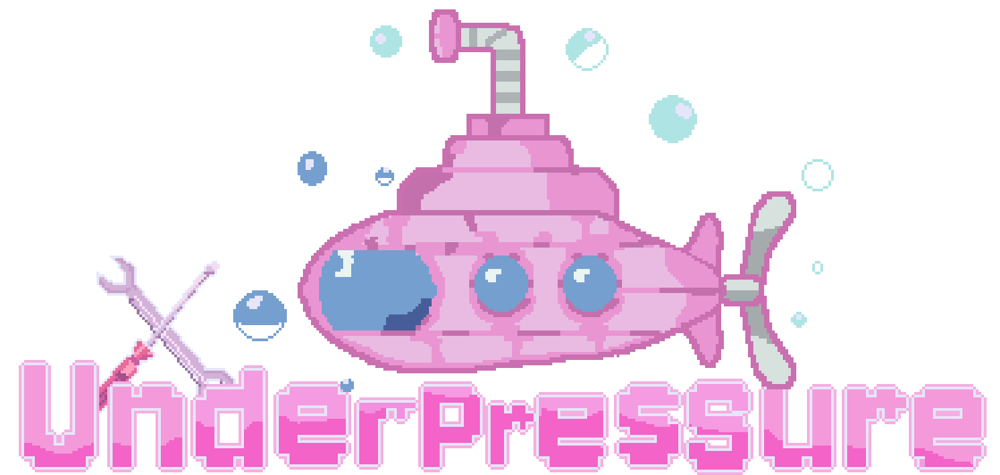

  

<h1>Under Pressure</h1>
<b>A task-management game about racing to the surface while everything goes wrong.</b>

## Introduction

<b>Under Pressure</b> is a 3D task-management game that was built in <b>42-hours</b> for the [University of Rochester's DandyHacks 2024](https://dandyhacks.net/). In the game, you operate a malfunctioning submarine, and must fix different failing components as you try to reach the surface. But watch out - if too many components break you'll sink and be lost at sea forever. 
Don't let the pressure get to you!

[Gameplay Video](https://youtu.be/Bf4K-OTwks8) 

You can download or try the game's web build for free [here](https://tdavies.itch.io/under-pressure)!

## Gameplay and Features
* 20+ custom 3D models and animated components
* 6 interactable components (that must be fixed when they break)
* Open-source sound effects that signal interactions
* Real-time 3D lighting
* 3D and 2D shaders
* Programmed in Godot and modeled using Blender

## Awards
At the hackathon, our project recieved the two following awards:

**1st Place in DandyHacks '24s Entertainment Track**
> How can technology impact film, music, or video games?
> 
> \- [DandyHacks '24 Website](https://dandyhacks.net/#tracks)

**Most Dandy Hack at DandyHacks '24 (People's Choice)**
> Voted on by all hackathon participants: the most creative project.
> 
> \- [DandyHacks '24 DevPost](https://dandyhacks-24.devpost.com/)

## Credits

**3D Artist:** *Caroline Li* 

**2D Artist:** *Rae Zhang*

**Programmers:** *Michael Reidy*, *Tiago Davies*

[Detailed Credits](credits.txt)

# Progress Photos

