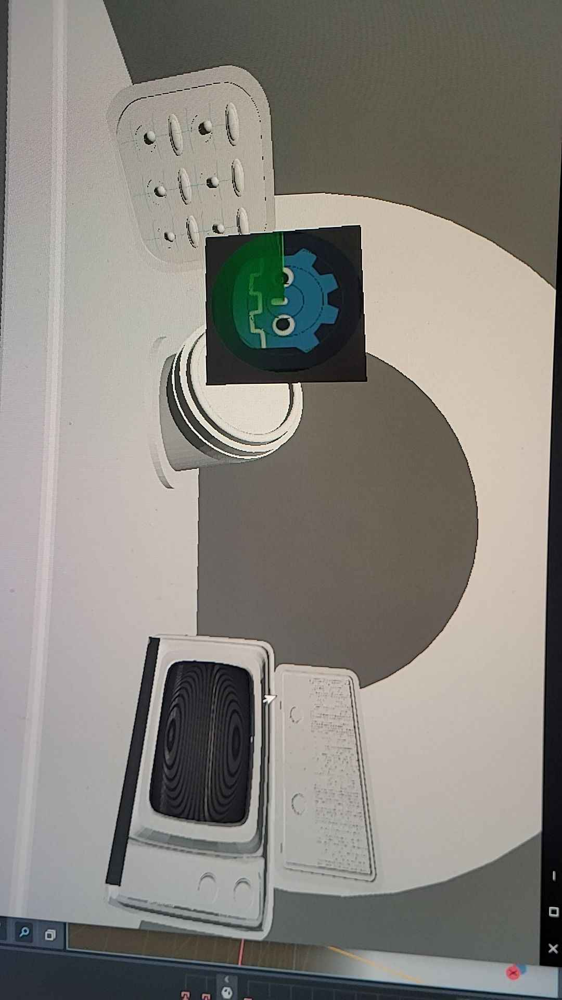
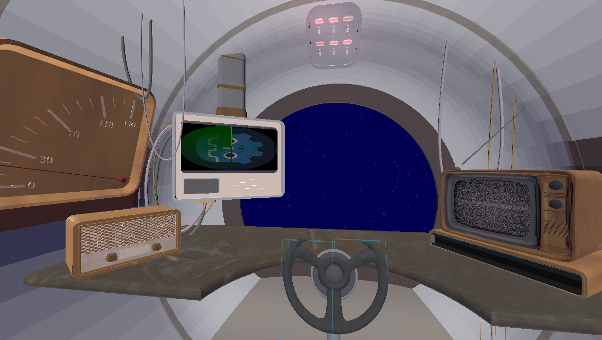
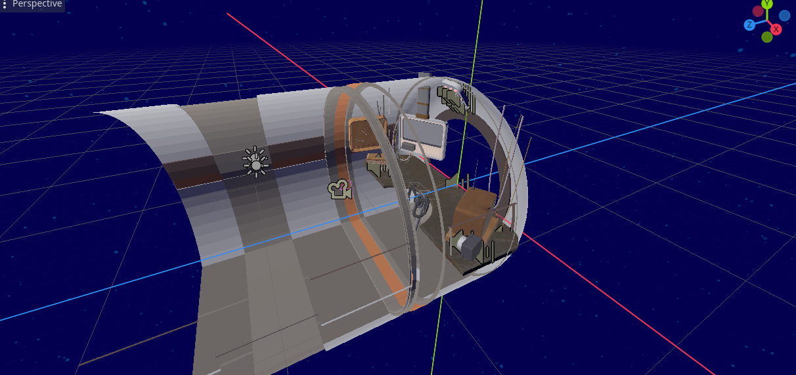
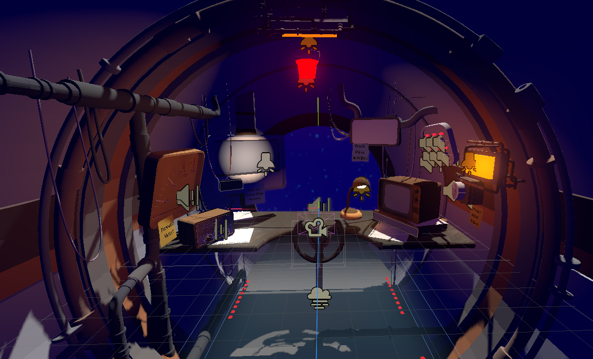

## Video:  
[Gameplay Video](https://youtu.be/6BKuC0HZrIs)  

## Download Here:  
[Download](https://tdavies.itch.io/under-pressure)

# Awards
* Winner of DandyHacks'24 Entertainment category
* Voted people's choice out of all submissions

# Features
* 20+ all hand-made 3D models by Caroline Li
* 3D real-time lighting
* 3D and 2D shaders
* 3D animated components
* Programmed in an Open-Source Engine

# Progress Photos

# Credits

[Detailed Credits](credits.txt) 
 
3D artist:  **Caroline Li**  
 
2D artist:  **Rae Zhang**  
 
Programmers:  
**Michael Reidy**  
**Tiago Davies** 
 
